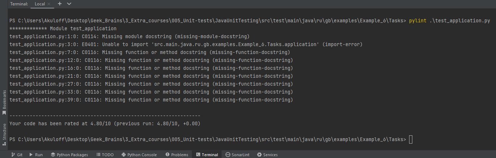

# Урок 6. Юнит тестирование в других языках

## Задание 1.

Создайте программу на Python или Java, которая принимает два списка чисел и выполняет следующие действия:

1. Рассчитывает среднее значение каждого списка.
2. Сравнивает эти средние значения и выводит соответствующее сообщение:
- "Первый список имеет большее среднее значение", если среднее значение первого списка больше.
- "Второй список имеет большее среднее значение", если среднее значение второго списка больше.
- "Средние значения равны", если средние значения списков равны.

## Важно:

- Приложение должно быть написано в соответствии с принципами объектно-ориентированного программирования.
- Используйте Pytest (для Python) или JUnit (для Java) для написания тестов, которые проверяют правильность работы программы. 
- Тесты должны учитывать различные сценарии использования вашего приложения.
- Используйте pylint (для Python) или Checkstyle (для Java) для проверки качества кода.
- Сгенерируйте отчет о покрытии кода тестами. Ваша цель - достичь минимум 90% покрытия.

## Формат и требования к сдаче:

Отчет о выполнении этого задания должен включать в себя следующие элементы:
- Код программы
[точка входа,](https://github.com/MikhailAkulov/Java_Unit_Testing/blob/main/src/main/java/ru/gb/examples/Example_6/Tasks/main.py)
[функционал приложения](https://github.com/MikhailAkulov/Java_Unit_Testing/blob/main/src/main/java/ru/gb/examples/Example_6/Tasks/application.py)
- Код тестов
[test_application](https://github.com/MikhailAkulov/Java_Unit_Testing/blob/main/src/test/main/java/ru/gb/examples/Example_6/Tasks/test_application.py)
- Отчет pylint/Checkstyle

    `pylint_main`

    `pylint_application`

    `pylint_test_application`

- Отчет о покрытии тестами

    к сожалению, в `Community Edition` его не добыть, а SolarLint Report выдаёт такую картину:

- Объяснение того, какие сценарии покрыты тестами и почему вы выбрали именно эти сценарии.

    `Ответ:`
По большому счёту программа простейшая, класс `Application` включает в себя всего 2 функции:
первая вычисляет среднее значение списка, а вторая - используя первую, сравнивает средние значения двух списков.

    Сценарии тестов:
    * Проверка соответствия ожидаемых результатов работы функции вычисления среднего значения при передаче правильных входных данных
    * Проверка соответствия ожидаемого результата функции вычисления среднего значения при передаче пустого списка
    * Проверка вызова исключение TypeError, если функции передается не список
    * Проверка вызова исключение TypeError, если в список передаются не цифры
    * Проверка корректной работы функции сравнения средних сначений списков, если среднее значение первого списка больше
    * Проверка корректной работы функции сравнения средних сначений списков, если среднее значение второго списка больше
    * Проверка корректной работы функции сравнения средних сначений списков, если средние значения списков равны

